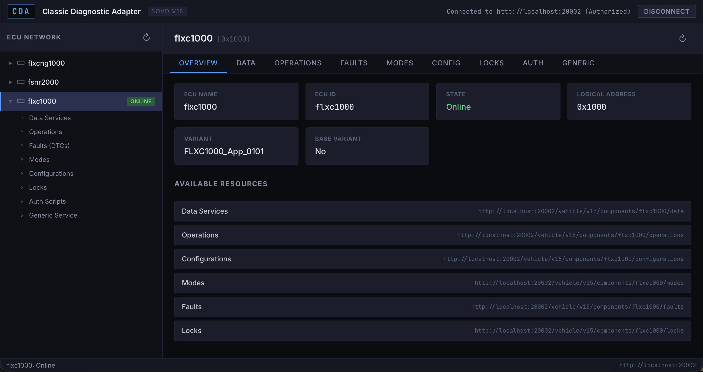

# CDA-UI

A web-based diagnostic interface for vehicle ECUs using the SOVD (Service-Oriented Vehicle Diagnostics) v15 protocol.



## Features

- **ECU Network Browser** — Tree view of all connected ECUs with variant identification and state monitoring
- **Data Services** — Read and write ECU data identifiers (DIDs)
- **Configurations** — Inspect ECU configuration parameters
- **Operations** — Execute diagnostic operations with dynamically generated parameter forms; supports async execution polling
- **Faults / DTCs** — View and clear diagnostic trouble codes with status bits
- **Modes** — View and set ECU diagnostic modes
- **Locks** — Create and delete ECU resource locks
- **Generic UDS** — Send raw hex UDS commands directly to an ECU
- **Auth Scripts** — Built-in JavaScript editor for running custom multi-step authentication flows (e.g. ZenZefi certificate exchange)

## Tech Stack

| Category | Technology |
|----------|------------|
| Framework | Vue 3 (Composition API, `<script setup>`) |
| Language | TypeScript |
| Build Tool | Vite 8 |
| Linting | ESLint |

No external UI library, router, or state management library — the project is intentionally minimal in dependencies.

## Getting Started

### Prerequisites

- **Node.js** >= 18
- A running **CDA backend** on `localhost:20002` (the dev server proxies all API calls there)

### Install

```sh
npm install
```

### Development

```sh
npm run dev
```

Opens the UI at [http://localhost:5173/ui/](http://localhost:5173/ui/). The Vite dev server proxies `/vehicle/*` and `/health/*` requests to the CDA backend at `localhost:20002`.

### Production Build

```sh
npm run build
```

Output goes to `dist/`. The build uses `/ui/` as its base path so it can be served embedded in the CDA binary.

### Preview Production Build

```sh
npm run preview
```

## Project Structure

```
src/
├── main.ts                         # Vue entry point
├── App.vue                         # Root component — layout, auth state, ECU selection
├── App.css                         # Application styles
├── index.css                       # Global styles
├── env.d.ts                        # TypeScript declarations for .vue modules
├── api/
│   └── client.ts                   # SovdClient — typed wrapper around the SOVD v15 REST API
├── components/
│   ├── LoginPanel.vue              # Connection & OAuth login form with health check
│   ├── EcuTree.vue                 # Sidebar ECU network tree with expandable sub-items
│   ├── EcuDetailPanel.vue          # Tab container for the selected ECU
│   ├── OverviewTab.vue             # ECU info overview (name, state, variant, resources)
│   ├── DataTab.vue                 # Read ECU data identifiers (DIDs)
│   ├── OperationsTab.vue           # Execute diagnostic operations with parameter forms
│   ├── ExecutionList.vue           # Table of active/completed operation executions
│   ├── ExecResultPanel.vue         # Execution result display with status and output params
│   ├── FaultsTab.vue               # View and clear diagnostic trouble codes
│   ├── StatusBit.vue               # Single DTC status bit indicator
│   ├── ModesTab.vue                # Read and set diagnostic modes
│   ├── ConfigurationsTab.vue       # Read ECU configuration parameters
│   ├── LocksTab.vue                # Acquire and release ECU resource locks
│   ├── GenericServiceTab.vue       # Send raw hex UDS commands
│   ├── AuthScripts.vue             # Script editor and runner for auth flows
│   ├── ParameterForm.vue           # Dynamic form from JSON Schema definitions
│   ├── ParamField.vue              # Individual parameter field (string, enum, number, etc.)
│   └── JsonField.vue               # JSON textarea with validation
├── lib/
│   ├── scriptRunner.ts             # Sandboxed JavaScript execution engine
│   └── paramUtils.ts               # Parameter schema utility (defaultsFromSchema)
└── types/
    └── sovd.ts                     # TypeScript interfaces for the SOVD API
```

## Development Notes

### API Proxy

During development, Vite proxies two paths to the CDA backend:

| Path | Target |
|------|--------|
| `/vehicle/*` | `http://localhost:20002` |
| `/health/*` | `http://localhost:20002` |

This is configured in `vite.config.ts`.

### Forward Proxy

A custom Vite plugin exposes `/__proxy/` which forwards arbitrary HTTP requests from the browser, bypassing CORS and TLS restrictions. This is used by auth scripts that need to reach external services (e.g. a local ZenZefi certificate server on `https://localhost:61000`).

### Production Deployment

In production the UI is served at the `/ui/` base path, bundled directly into the CDA binary. No separate web server is needed.

## Contributing

Contributions are welcome. Please open an issue or submit a pull request.

## License

Licensed under [Apache-2.0](LICENSE).

SPDX-License-Identifier: Apache-2.0
SPDX-FileCopyrightText: 2026 Elena Gantner
